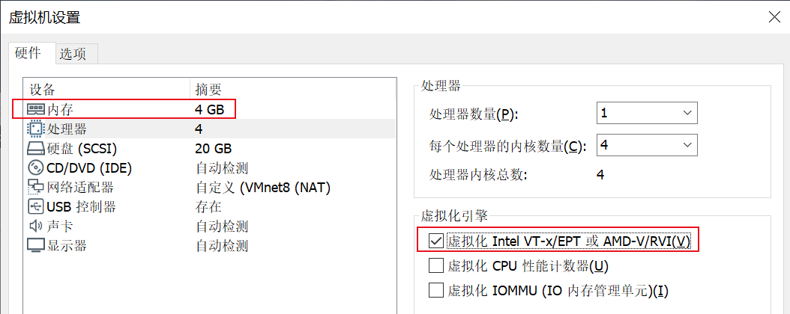

## 1. 宿主机配置:



#### 修改网卡名为 `eth0`

```bash
# 在安装系统时输入的命令
net.ifnames=0 biosdevname=0
```

## 2. `epel源`

- RHEL/CentOS 7:

```bash
yum install https://dl.fedoraproject.org/pub/epel/epel-release-latest-7.noarch.rpm
```

- RHEL/CentOS 8:

```bash
dnf install https://dl.fedoraproject.org/pub/epel/epel-release-latest-8.noarch.rpm
```

## 3. 安装`kvm`软件包

```bash
dnf install libvirt virt-install qemu-kvm
dnf install libvirt virt-install qemu-kvm --downloadonly --downloaddir=./cloudCalc
dnf clean packages
```

## 4. 开启服务:

```bash
systemctl enable --now libvirtd.service
systemctl status libvirtd.service
```


## 5. 下载VNC图形化界面软件

[VNC Viewer](https://www.realvnc.com/en/connect/download/viewer/)

默然端口: `5900`

## 6. 安装虚拟机

#### `virt-install - provision new virtual machines`

```bash
virt-install \
--name centos7 \
--memory 1024 \
--vcpus 4 \
--virt-type kvm \
--os-variant centos7.0 \
--disk /opt/CentOS-7_1.qcow2,format=qcow2,size=10 \
--cdrom /opt/CentOS-7-x86_64-Minimal-1908.iso \
--network network=default \
--graphics vnc,listen=0.0.0.0 \
--noautoconsole

virt-install --name centos7 --memory 1024 --vcpus 4 --virt-type kvm --os-variant centos7.0 --disk /opt/CentOS-7_1.raw,format=raw,size=10 --cdrom /opt/CentOS-7-x86_64-Minimal-1908.iso --network network=default --graphics vnc,listen=0.0.0.0 --noautoconsole
```

#### the mining of the functions: 

```txt
--virt-type: The hypervisor to install on
--os-variant: Optimize the guest configuration for a specific operating system 
	(ex.'fedora29', 'rhel7', 'win10').
--name: Name of the new guest virtual machine instance.
--memory: Memory to allocate for the guest, in MiB.
--vcpus: Number of virtual cpus to configure for the guest.
--disk: Specifies media to use as storage for the guest, with various options.
	example: --disk /some/storage/path[,opt1=val1]...
	format: Disk image format. For file volumes, this can be 'raw','qcow2', 'vmdk', etc.
	size: size (in GiB) to use if creating new storage
--cdrom PATH: ISO file or CDROM device to use for VM install media.
--network: Connect the guest to the host network.
	network=NAME; In an unmodified install of "libvirt" there is usually a virtual 		
	network with a name of "default".
--graphics TYPE: Specifies the graphical display configuration.
	--graphics TYPE,opt1=arg1,opt2=arg2,...
	For example: --graphics vnc,password=foobar
	listen: Address to listen on for VNC/Spice connections. Default is typically 
	127.0.0.1 (localhost only), Use 0.0.0.0 to allow access from other machines.
--noautoconsole: Don't automatically try to connect to the guest console.

```

#### 备份配置文件

```bash
virsh dumpxml centos7 > centOS-7.xml
```

#### 删除虚拟机

```bash
# 删除前先关闭 *****
virsh shutdown centos7

virsh undefine centos7
```

#### 导入虚拟机

```bash
virsh define centos7
```

```bash
[root@me ~]# ls /etc/libvirt/qemu
centos7.xml  networks
```

##### 修改配置文件, 转移数据

```bash
[root@me opt]# ls
CentOS-7_1.raw  CentOS-7-x86_64-Minimal-1908.iso  centOS-7.xml
[root@me opt]# mv CentOS-7_1.raw /data/
[root@me opt]# ls
CentOS-7-x86_64-Minimal-1908.iso  centOS-7.xml
[root@me opt]# ls /data/
CentOS-7_1.raw
[root@me opt]# virsh start centos7 
error: Failed to start domain centos7
error: Cannot access storage file '/opt/CentOS-7_1.raw': No such file or directory
```


```bash
virsh edit centos7
```

#### 重命名

```bash
# 重命名前先关机
virsh shutdown centos7

virsh domrename domainName newDomainName

```

#### 挂起与恢复主机

```bash
virsh suspend domainName
virsh resume domainName
```

#### 查看`vnc`端口号

```bash
virsh vncdisplay domainName
```

#### 开机自启动

```bash
# 本质是在 /etc/libvirt/qemu/autorestart 文件夹下创建了 /etc/libvirt/qemu/domainName.xml 的软连接
virsh autostart domainName
virsh autostart --disable domainName
```

#### `console`登录`kvm`虚拟机

```bash
# 修改系统内核
grubby --update-kernel=ALL --args="console=ttyS0,115200n8"
vim /boot/grub2/grub.cfg
reboot

virsh console domainName
```

# 7. 磁盘工具的常用命令

#### 查看硬盘信息

```bash
[root@me opt]# qemu-img info /data/CentOS-7_1.raw 
image: /data/CentOS-7_1.raw
file format: raw
virtual size: 10G (10737418240 bytes)
disk size: 1.5G

```

#### 创建新硬盘

```bash
# qemu copy on write 
qemu-img create -f qcow2 /data/test.qcow2 1G
```

#### 更改磁盘容量

```bash
# qcow2只能扩容, 不能减少; raw 可以扩容也可以缩容
# 生产上只扩容, 不缩容, 容易丢数据
# 人在家中做, 锅从天上来
[root@me data]# qemu-img resize test.qcow2 2G
Image resized.

[root@me data]# qemu-img create NGB.raw 2G
Formatting 'NGB.raw', fmt=raw size=2147483648

[root@me data]# qemu-img resize NGB.raw -1G
WARNING: Image format was not specified for 'NGB.raw' and probing guessed raw.
         Automatically detecting the format is dangerous for raw images, write operations on block 0 will be restricted.
         Specify the 'raw' format explicitly to remove the restrictions.
qemu-img: warning: Shrinking an image will delete all data beyond the shrunken image's end. Before performing such an operation, make sure there is no important data there.
qemu-img: warning: Using the --shrink option will suppress this message. Note that future versions of qemu-img may refuse to shrink images without this option.
Image resized.
```

#### 磁盘文件系统格式转换

```bash
qemu-img convert -f raw -O qcow2 NGB.raw NGB.qcow2

time qemu-img convert -f raw -O qcow2 CentOS-7_1.raw CentOS-7_1.qcow2

```


```xml
<disk type='file' device='disk'>
      <driver name='qemu' type='qcow2'/>
      <source file='/data/CentOS-7_1.qcow2'/>
      <target dev='vda' bus='virtio'/>
      <address type='pci' domain='0x0000' bus='0x04' slot='0x00' function='0x0'/>
</disk>
```

# 8. 快照管理

#### 创建快照

```bash
# 默认以时间戳命名快照名
virsh snapshot-create web-blog

# 自定义命名快照
[root@me opt]# virsh snapshot-create-as web-blog --name env-new
Domain snapshot env-new created
```

#### 查看快照

```bash
[root@me opt]# virsh snapshot-list web-blog 
 Name                 Creation Time             State
------------------------------------------------------------
 env-new              2020-02-09 20:43:23 +0800 shutoff
```

#### 删除快照

```bash
[root@me opt]# virsh snapshot-delete web-blog --snapshotname env-new 
Domain snapshot env-new deleted
```

#### 恢复快照

```bash
# 只有qcow2文件系统才支持快照功能
# 但是时间也是, 之前的时间, 需要添加定时任务,校对时间
virsh snapshot-revert web-blog --snapshotname env-new
```


